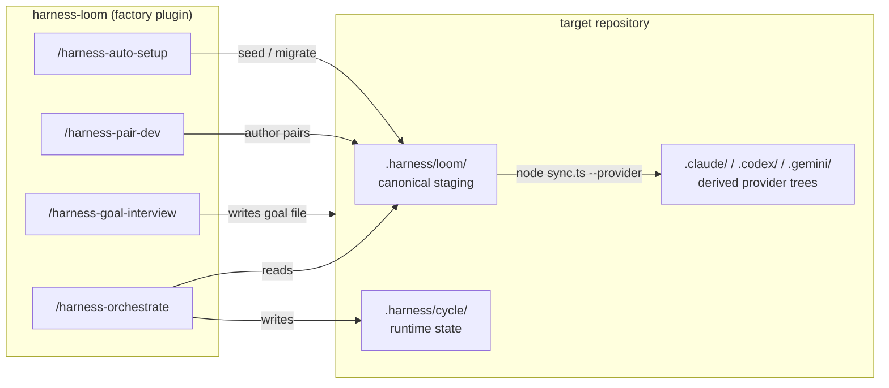

# harness-loom

[English](../README.md) | [한국어](README.ko.md) | [日本語](README.ja.md) | [简体中文](README.zh-CN.md) | [Español](README.es.md)

[](../CHANGELOG.md)
[](../LICENSE)
[](../README.md#multi-platform)

**Afina un harness específico para tu producción sobre el harness genérico que entregan los asistentes de codificación modernos.**

<br clear="left" />

> En caso de discrepancia, el [README en inglés](../README.md) es la versión normativa.

## Qué hace

`harness-loom` es un plugin de fábrica que instala un harness en tiempo de ejecución dentro de un repositorio destino y lo hace crecer pareja por pareja. La fábrica entrega cuatro comandos slash para el usuario (`/harness-init`, `/harness-auto-setup`, `/harness-pair-dev`, `/harness-goal-interview`) y un script `sync.ts`. Una vez instalado, tu destino dispone de un planner, un orquestador, un plano de control compartido bajo `.harness/`, y un sitio donde añadir parejas producer-reviewer específicas del proyecto a lo largo del tiempo.

Esto es ajuste fino del harness, no del modelo —codifica los estándares de revisión de tu repo, las formas de las tareas y la definición de hecho en infraestructura versionada en lugar de re-promptearla en cada sesión. `harness-loom` es para equipos que ya ven el potencial de calidad de producción en su stack de asistentes y ahora quieren que se comporte como un sistema en lugar de como una sesión.

## Inicio rápido

Instala la fábrica en Claude Code (o Codex / Gemini —ver [Instalar la fábrica](#instalar-la-fábrica) para todas las opciones):

```text
/plugin marketplace add KingGyuSuh/harness-loom
/plugin install harness-loom@harness-loom-marketplace
```

Dentro de tu repositorio destino:

```bash
# 1. sembrar o migrar .harness/
/harness-auto-setup --setup

# 2. derivar el árbol de runtime del asistente
node .harness/loom/sync.ts --provider claude
#   (añade codex,gemini para multi-plataforma)
```

Hasta aquí queda la foundation. Para añadir parejas producer-reviewer específicas del proyecto y ejecutar tu primer ciclo, ver [Empezar un proyecto destino](#empezar-un-proyecto-destino).

## Cómo funciona



El plugin de fábrica vive en tu CLI de asistente; ejecutar sus comandos slash dentro de un repositorio destino escribe en `.harness/loom/` (staging canónico que poseen el setup y el authoring de pares) y `.harness/cycle/` (estado en tiempo de ejecución que posee el orquestador). Los árboles de plataforma (`.claude/`, `.codex/`, `.gemini/`) son artefactos derivados que regeneras con `sync.ts` cada vez que el staging canónico cambia —nunca los edites directamente. El turno **Finalizer** de cierre de ciclo escribe los artefactos de la raíz del destino (documentación, auditoría, notas de release) directamente en el destino, no dentro de `.harness/`.

## Por qué esta forma

- **Skill primero, agente después.** La metodología compartida vive en un único `SKILL.md` por pareja, de modo que las reglas de producción y de revisión permanezcan alineadas.
- **Producer más Reviewers.** Una pareja puede abrirse en abanico hacia uno o varios reviewers, cada uno calificando un eje distinto.
- **Canónico una vez, deriva hacia fuera.** Author del harness en `.harness/loom/`; deriva `.claude/`, `.codex/` y `.gemini/` solo cuando los quieras.
- **Ejecución dirigida por hooks.** El orquestador escribe el siguiente dispatch en `.harness/cycle/state.md`, y los hooks vuelven a entrar al ciclo sin contabilidad manual.
- **Authoring anclado al repo.** La generación de pares lee la base de código real del destino para poder citar archivos y patrones reales en lugar de generar boilerplate abstracto.

## Qué se instala

```text
target project
└── .harness/
    ├── loom/                    # canonical staging (setup + pair authoring own; sync reads)
    │   ├── skills/{harness-orchestrate, harness-planning, harness-context}/
    │   ├── agents/{harness-planner, harness-finalizer}.md
    │   ├── hook.sh
    │   └── sync.ts
    ├── cycle/                   # runtime state (orchestrator owns)
    │   ├── state.md, events.md
    │   └── epics/, finalizer/tasks/
    ├── _snapshots/              # auto-setup provenance (when migration runs)
    └── _archive/                # past cycles (created on goal-different reset)
```

La documentación del proyecto (`*.md` en la raíz del destino, `docs/`) se author **directamente en el destino**, no dentro de `.harness/`. El orquestador funciona como un DFA de cuatro estados —`Planner | Pair | Finalizer | Halt`. Cuando todo EPIC alcanza terminal y no queda continuación del planner, despacha el agente singleton `harness-finalizer` antes de detenerse; reemplazas su cuerpo por el trabajo de cierre de ciclo concreto que necesite el proyecto (refresco de documentación, inspección de cobertura de la request, preparación de release, salida de auditoría).

`/harness-auto-setup` es el punto de entrada más seguro: `--setup` (por defecto) hace bootstrap de un destino nuevo o extiende un harness existente de forma aditiva; `--migration` hace snapshot de `.harness/loom/` y `.harness/cycle/` vivos, refresca la foundation y conserva la guía custom compatible de pares/finalizer.

## Requisitos

- **Node.js ≥ 22.6** —los scripts corren con stripping nativo de TypeScript; sin paso de build, sin `package.json`.
- **git** —recomendado para revisar los cambios generados del harness y recuperar experimentos locales mediante tu flujo VCS habitual.
- **Al menos un CLI de asistente compatible**, autenticado:
  - [Claude Code](https://code.claude.com/docs) —objetivo principal; el staging canónico en `.harness/loom/` se deriva en `.claude/` mediante `node .harness/loom/sync.ts --provider claude`.
  - [Codex CLI](https://developers.openai.com/codex/cli) —se deriva en `.codex/` mediante `node .harness/loom/sync.ts --provider codex`; los TOMLs de agente generados mencionan explícitamente los cuerpos `$skill-name` requeridos.
  - [Gemini CLI](https://geminicli.com/docs/) —se deriva en `.gemini/` mediante `node .harness/loom/sync.ts --provider gemini`; los cuerpos de agente generados nombran las skills requeridas porque el frontmatter de Gemini rechaza `skills:`.

## Instalar la fábrica

En la práctica hay dos instalaciones:

1. Instalar el **plugin de fábrica** en Claude Code o Codex CLI.
2. Dentro de cada repositorio destino, ejecutar `/harness-auto-setup --setup` (o `--migration` para upgrades de delta mínimo de un harness existente) para sembrar, inspeccionar o migrar `.harness/`, y después `node .harness/loom/sync.ts --provider <list>` para desplegar los árboles en tiempo de ejecución específicos del asistente que realmente quieras usar.

La fábrica se distribuye con el layout monorepo estándar `plugins/<name>/` —la raíz del repo contiene `.claude-plugin/marketplace.json` y `.agents/plugins/marketplace.json`, y el árbol del plugin propiamente dicho vive bajo `plugins/harness-loom/`.

Elige una vía de instalación de la fábrica abajo. La mayoría de usuarios instala la fábrica desde Claude Code o Codex CLI, y después usa el runtime generado desde cualquiera de los asistentes que quiera dentro de los repositorios destino.

### Claude Code

Sanity test local (un disparo, sin marketplace):

```bash
claude --plugin-dir ./plugins/harness-loom
```

Instalación persistente vía marketplace en sesión. Checkout local:

```text
/plugin marketplace add ./
/plugin install harness-loom@harness-loom-marketplace
```

Repo git público (GitHub shorthand):

```text
/plugin marketplace add KingGyuSuh/harness-loom
/plugin install harness-loom@harness-loom-marketplace
```

Fija un tag específico si lo necesitas:

```text
/plugin marketplace add KingGyuSuh/harness-loom@<tag>
/plugin install harness-loom@harness-loom-marketplace
```

### Codex CLI

Añade la fuente de marketplace —el argumento apunta a la raíz del repo (que contiene `.agents/plugins/marketplace.json`):

```bash
# checkout local
codex marketplace add /path/to/harness-loom

# repo git público
codex marketplace add KingGyuSuh/harness-loom

# fija un tag si es necesario
codex marketplace add KingGyuSuh/harness-loom@<tag>
```

Después, dentro del TUI de Codex, ejecuta `/plugins`, abre la entrada de marketplace `Harness Loom` e instala el plugin.

### Gemini Runtime

Usa Claude Code o Codex CLI para instalar la fábrica, y luego deriva `.gemini/` dentro del proyecto destino:

1. Desde Claude Code o Codex CLI, instala la fábrica y ejecuta `/harness-auto-setup --setup --provider gemini`, después `node .harness/loom/sync.ts --provider gemini` dentro de tu proyecto destino. Esto despliega el runtime del lado del destino (`.harness/loom/`, `.harness/cycle/`, `.gemini/agents/`, `.gemini/skills/`, `.gemini/settings.json` con el hook `AfterAgent`).
2. `cd` a ese proyecto destino y ejecuta `gemini`. El CLI auto-carga los `.gemini/agents/*.md` y `.gemini/skills/<slug>/SKILL.md` de scope de workspace, y el hook `AfterAgent` desde `.gemini/settings.json`.
3. Tu ciclo de orquestador corre en Gemini de extremo a extremo —el authoring de fábrica permanece en Claude/Codex, la ejecución puede ser cualquiera de los tres.

## Empezar un proyecto destino

Una vez que la fábrica está instalada en tu asistente, el flujo habitual del repo destino es:

1. Sembrar `.harness/`, configurar pares/finalizer por forma de proyecto, o migrarlo con `/harness-auto-setup --setup` o `/harness-auto-setup --migration`.
2. Desplegar al menos un árbol de runtime de asistente con `sync.ts`.
3. Añadir las primeras parejas producer-reviewer para tu repo.
4. Opcionalmente personalizar el finalizer de cierre de ciclo.
5. Ejecutar `/harness-orchestrate <file.md>`.

### 1. Setup o migración del repositorio destino

Abre el repositorio destino en Claude Code o Codex CLI y ejecuta:

```text
/harness-auto-setup --setup --provider claude
```

Usa una lista de providers separada por comas cuando sepas qué árboles de plataforma vas a refrescar:

```text
/harness-auto-setup --setup --provider claude,codex,gemini
```

`--setup` siembra un destino nuevo a través del instalador de foundation y mantiene el finalizer por defecto hasta que se elija un trabajo de cierre de ciclo concreto. Los destinos nuevos requieren análisis de proyecto del lado del asistente (LLM) antes de que se authorgan los archivos de pares/finalizer; la mera presencia de docs/tests/CI ya no crea `harness-document` ni `harness-verification`. Si el destino ya tiene `.harness/loom/` o `.harness/cycle/`, `--setup` no hace snapshot, ni reseed, ni restauración, ni reconstrucción, ni migración; inspecciona el harness vivo y las señales del repo, y después continúa con análisis de proyecto, preguntas concisas al usuario cuando sea necesario, y authoring aditivo de pares/finalizer bajo `.harness/loom/`.

Cuando quieras un upgrade de delta mínimo de un harness existente en lugar de la convergencia en modo setup, ejecuta:

```text
/harness-auto-setup --migration --provider claude
```

El modo migración conserva la guía de pares/finalizer escrita por el usuario donde sea posible, incluidas secciones H2 renombradas o personalizadas que sean compatibles, y refresca superficies propiedad del contract como el frontmatter requerido, `skills:`, los bloques Output Format y el contract Structural Issue del finalizer. El resumen JSON incluye un `convergence.migrationPlan` con un plan de overlay source/target. La snapshot sigue siendo provenance de máquina y evidencia de migración, no una fuente restaurada de verdad.

Si solo quieres un reset de foundation sin convergencia, ejecuta:

```text
/harness-init
```

Esto escribe el árbol de staging canónico bajo `.harness/loom/` y el scaffold de estado en tiempo de ejecución bajo `.harness/cycle/`. Siembra `state.md`, `events.md`, `epics/` y `finalizer/tasks/`; no crea placeholders de snapshot de goal/request, ni `.claude/`, ni `.codex/`, ni `.gemini/`.

Si re-ejecutas `/harness-init` más adelante, trátalo como un reset del scaffolding del harness del lado del destino: el contenido de `.harness/loom/` author por pares y el estado actual de `.harness/cycle/` son re-sembrados en lugar de preservados. Usa `/harness-auto-setup --setup` para bootstrap nuevo o configuración aditiva por forma de proyecto, y `/harness-auto-setup --migration` cuando quieras un refresh de contract de delta mínimo de una foundation existente.

### 2. Desplegar el runtime de asistente que realmente quieras usar

Deriva al menos un árbol de plataforma desde el staging canónico:

```bash
node .harness/loom/sync.ts --provider claude
```

Para despliegue multi-plataforma:

```bash
node .harness/loom/sync.ts --provider claude,codex,gemini
```

Vuelve a ejecutar este comando tras cualquier edición de pares o finalizer. `.harness/loom/` es la authoring surface; `.claude/`, `.codex/` y `.gemini/` son salidas derivadas.

### 3. Añadir las primeras parejas

Crea pares que coincidan con cómo se descompone el trabajo en tu repo. Los slugs canónicos de pareja usan el prefijo `harness-`, y toda pareja debe incluir al menos un reviewer. Los asistentes pueden aceptar un nombre breve como `document`, pero los archivos generados y las entradas del registry siempre se escriben como `harness-document`.

```text
/harness-pair-dev --add harness-game-design "Spec snake.py features and edge cases"
/harness-pair-dev --add harness-impl "Implement snake.py against the spec" --reviewer harness-code-reviewer --reviewer harness-playtest-reviewer
```

Tras authoring, mejorar o eliminar pares, vuelve a ejecutar `node .harness/loom/sync.ts --provider <list>` para que los árboles de plataforma recojan los agentes y skills actuales.

### 4. Personalizar el Finalizer si necesitas trabajo de cierre de ciclo

El `.harness/loom/agents/harness-finalizer.md` sembrado es un no-op seguro. Por defecto devuelve `Status: PASS` con `Summary: no cycle-end work registered for this project` y no toca ningún archivo.

Déjalo tal cual si solo quieres que el ciclo se detenga limpio.

Edítalo si tu proyecto necesita trabajo de cierre de ciclo como:

- refrescar `CLAUDE.md`, `AGENTS.md` o `docs/`
- comprobar la cobertura del goal frente a `.harness/cycle/events.md`
- escribir notas de release o artefactos de auditoría
- snapshotear esquemas o reportes derivados

Tras editar el cuerpo del finalizer, vuelve a ejecutar `sync.ts` para desplegar el agente actualizado en los árboles de plataforma.

### 5. Ejecutar el primer ciclo

Crea un archivo de request y arranca el orquestador:

```bash
cat > goal.md <<'EOF'
Ship a lightweight terminal Snake game with curses
EOF

/harness-orchestrate goal.md
```

Los artefactos aterrizan bajo `.harness/cycle/epics/EP-N--<slug>/{tasks,reviews}/`. El estado en tiempo de ejecución vive en `.harness/cycle/state.md`, la request original completa vive en `.harness/cycle/user-request-snapshot.md`, y el log de eventos append-only vive en `.harness/cycle/events.md`. Cuando todo EPIC vivo alcanza terminal y no queda continuación del planner, el orquestador entra en el **estado Finalizer**, ejecuta el singleton `harness-finalizer` y se detiene.

## Lo que normalmente personalizas

La mayoría de usuarios solo necesita personalizar tres cosas:

- **Pares** —añade, mejora y elimina parejas producer-reviewer hasta que reflejen la descomposición real del trabajo de tu repo y los ejes de revisión. Si una pareja se ha convertido en dos trabajos distintos, añade o mejora explícitamente los reemplazos y luego elimina la pareja vieja.
- **Cuerpo del finalizer** —reemplaza el no-op por defecto solo si tu proyecto necesita trabajo de cierre de ciclo en la raíz del destino.
- **Archivos de request del ciclo** —cada ciclo arranca desde un archivo de request author por el usuario, a menudo llamado `goal.md`. El orquestador conserva el cuerpo completo en `.harness/cycle/user-request-snapshot.md` y pasa esa ruta a través de los dispatch envelopes como `User request snapshot`; `Goal` permanece como resumen compacto.

La mayoría de usuarios **no** necesita editar a mano:

- `harness-orchestrate`
- `harness-planning`
- `harness-context`
- `.harness/cycle/state.md`
- `.harness/cycle/events.md`

Trata estos como infraestructura de runtime salvo que estés cambiando intencionadamente el contract del harness en sí.

## Conceptos

Algunos términos se repiten a través de comandos, archivos y estado. Conocerlos basta para leer el resto de este repo:

- **Harness** —la capa persistente alrededor del asistente: archivos de estado, hooks, subagentes, contracts. `harness-loom` da forma a esta capa para que se ajuste a tu repo.
- **Pareja** —un **producer** más uno o más **reviewers** que comparten un único `SKILL.md`. La unidad de authoring del trabajo de dominio.
- **Producer** —el subagente que realiza el trabajo de una tarea (escribe código, specs, análisis) y devuelve el artefacto de tarea. Su `Status` es solo auto-reportado; los reviewers deciden el verdict de la pareja.
- **Reviewer** —un subagente que califica la salida del producer en un eje específico (calidad de código, ajuste a la spec, seguridad, etc.). Una pareja puede abrirse en abanico hacia muchos reviewers, cada uno calificando independientemente; sus valores `Verdict` son la fuente load-bearing del verdict del turno de la pareja.
- **EPIC / Tarea** —un EPIC es una unidad de resultado emitida por el planner; una Tarea es una sola ronda producer-reviewer dentro de ese EPIC. Los artefactos aterrizan bajo `.harness/cycle/epics/EP-N--<slug>/{tasks,reviews}/`.
- **Orquestador vs Planner** —el **orquestador** es dueño de `.harness/cycle/state.md` y corre como un DFA de cuatro estados (`Planner | Pair | Finalizer | Halt`), despachando exactamente un producer por respuesta (los turnos de pareja corren un producer más 1 o M reviewers en paralelo; los turnos de Finalizer corren un único agente de cierre de ciclo sin reviewer). El **planner** corre dentro de ese loop para descomponer el goal en EPICs, escoger la rebanada aplicable del roster global fijo de cada EPIC y declarar gates upstream del mismo stage entre EPICs.
- **Finalizer** —el hook de cierre de ciclo. El runtime entrega un único agente singleton `harness-finalizer` que se ejecuta cuando todo EPIC es terminal y no queda continuación del planner. No tiene reviewer emparejado; el verdict es el `Status` propio del finalizer más la evidencia mecánica de `Self-verification`. El `harness-finalizer` sembrado por defecto es un esqueleto genérico; el proyecto reemplaza su cuerpo por el trabajo de cierre de ciclo concreto que necesite.

## Comandos

| Comando | Propósito |
|---------|---------|
| `/harness-init` | Hace scaffolding del árbol de staging canónico `.harness/loom/` y del estado en tiempo de ejecución `.harness/cycle/` en el directorio de trabajo actual. Escribe las skills de runtime, el agente `harness-planner`, el esqueleto genérico de cierre de ciclo `harness-finalizer`, y las copias autocontenidas de `hook.sh` + `sync.ts` bajo `.harness/loom/`. Siembra `state.md`, `events.md`, `epics/` y `finalizer/tasks/`, pero ningún placeholder de snapshot de goal o request. Re-ejecutar la instalación re-siembra ambos espacios de nombres. No toca ningún árbol de plataforma. |
| `/harness-auto-setup [--setup \| --migration] [--provider <list>]` | Configura, ajusta o migra de forma segura el harness del directorio de trabajo actual. `--setup` (por defecto) bootstrap-ea destinos nuevos y requiere análisis de proyecto del lado del asistente antes de authoring de archivos de pares/finalizer en lugar de crear pares stock de docs/tests; en destinos existentes deja los archivos de foundation intactos y realiza solo authoring aditivo por forma de proyecto salvo que el usuario pida mejoras. `--migration` realiza un upgrade de delta mínimo para harnesses existentes: snapshot primero, refrescar la foundation, restaurar entradas custom de loom, y después conservar la guía de pares/finalizer mientras reescribe solo las superficies de runtime propiedad del contract y emite un plan de migración. Ambos modos terminan con un comando explícito de sync y no tocan ningún árbol de plataforma. |
| `node .harness/loom/sync.ts --provider <list>` | Despliega el `.harness/loom/` canónico en árboles de plataforma (`.claude/`, `.codex/`, `.gemini/`). Una sola vía; nunca escribe de vuelta en `.harness/loom/`. La selección de provider es explícita: una invocación bare sin flags de provider es un error. Claude conserva el frontmatter `skills:` del agente; Codex y Gemini reciben prompts de carga de skill requeridos en los cuerpos de agente generados. |
| `/harness-pair-dev --add <slug> "<purpose>" [--from <source>] [--reviewer <slug> ...] [--before <slug> \| --after <slug>]` | Author una nueva pareja producer-reviewer anclada al codebase actual. `<purpose>` es requerido. `--from` acepta o bien un slug de pareja viva actualmente registrada o un locator local del destino `snapshot:<ts>/<pair>` / `archive:<ts>/<pair>` como fuente del overlay template-first: la forma actual del harness queda fija mientras se conserva la guía de dominio fuente compatible. No es una ruta arbitraria del filesystem ni una importación del árbol de provider. Por defecto 1:1; repite `--reviewer` para topología 1:N de reviewers. El authoring escribe solo dentro de `.harness/loom/`; vuelve a ejecutar `node .harness/loom/sync.ts --provider <list>` después. |
| `/harness-pair-dev --improve <slug> "<purpose>" [--before <slug> \| --after <slug>]` | Mejora una pareja registrada existente con el `<purpose>` posicional como eje primario de revisión, y luego incorpora higiene de rubric y evidencia actual del repo. Si una pareja se ha convertido en dos trabajos distintos, usa pasos explícitos de add/improve/remove. Vuelve a ejecutar sync después para refrescar los árboles de plataforma. |
| `/harness-pair-dev --remove <slug>` | Da de baja de forma segura una pareja y borra solo los archivos `.harness/loom/` que pertenecen a esa pareja. Antes de mutar rechaza objetivos de foundation/singleton y referencias de ciclo activo en `## Next` o en los campos roster/current de los EPICs vivos, conserva el historial de tasks/reviews de `.harness/cycle/`, y no toca ningún árbol de provider; vuelve a ejecutar sync después. |
| `/harness-orchestrate <file.md>` | Punto de entrada de runtime del lado del destino. Lee el archivo de request, conserva su cuerpo completo en `.harness/cycle/user-request-snapshot.md`, y corre un DFA de cuatro estados (`Planner | Pair | Finalizer | Halt`) despachando exactamente un producer por respuesta; la re-entrada por hook avanza el ciclo desde `state.md` y la ruta de snapshot existente. Cuando todo EPIC alcanza terminal y la continuación del planner está clara, el orquestador entra en el estado Finalizer y despacha el singleton `harness-finalizer` antes de detenerse. |

## Multi-plataforma

Pins de plataforma aplicados por `sync.ts`:

| Plataforma | Modelo | Evento del hook | Notas |
|----------|-------|------------|-------|
| Claude | `inherit` | `Stop` | `.claude/settings.json` dispara `.harness/loom/hook.sh`. |
| Codex | `gpt-5.5`, `model_reasoning_effort: xhigh` | `Stop` | Los TOMLs de agente prependen las menciones requeridas `$skill-name` a `developer_instructions`; las skills se espejan bajo `.codex/skills/`. |
| Gemini | `gemini-3.1-pro-preview` | `AfterAgent` | Los cuerpos de agente nombran las skills requeridas; las skills se espejan bajo `.gemini/skills/`. |

## Cuándo usarlo

Usa `harness-loom` cuando:

- el entorno base del asistente ya es lo bastante capaz para hacer trabajo real en tu repo
- la brecha que queda es repetibilidad, estructura de revisión, continuidad de estado y ajuste al dominio
- quieres que las reglas del harness vivan en archivos versionados en lugar de re-promptearse ad hoc
- quieres una única authoring surface canónica con derivación multi-plataforma determinista

No lo elijas si todavía estás evaluando si el stack de modelos subyacente puede manejar tu trabajo en absoluto. Este proyecto asume que el harness genérico ya es útil y se centra en darle forma como sistema específico para producción.

## Contribuir

Bienvenidos issues, bug fixes y refinamientos de rubric. Mira [CONTRIBUTING.md](../CONTRIBUTING.md) para el dev loop, los comandos de smoke-test y la guía de scope (los nuevos skills invocables por el usuario o cambios al ritmo del orquestador empiezan como discussion). Para reportes de seguridad, mira [SECURITY.md](../SECURITY.md). Toda participación se rige por el [Code of Conduct](../CODE_OF_CONDUCT.md).

## Documentos del proyecto

- [CHANGELOG.md](../CHANGELOG.md) - historial de releases
- [CONTRIBUTING.md](../CONTRIBUTING.md) - setup de desarrollo y flujo de PR
- [SECURITY.md](../SECURITY.md) - divulgación responsable
- [CODE_OF_CONDUCT.md](../CODE_OF_CONDUCT.md) - expectativas de la comunidad
- [LICENSE](../LICENSE) - Apache 2.0
- [NOTICE](../NOTICE) - aviso de atribución requerido por Apache 2.0
