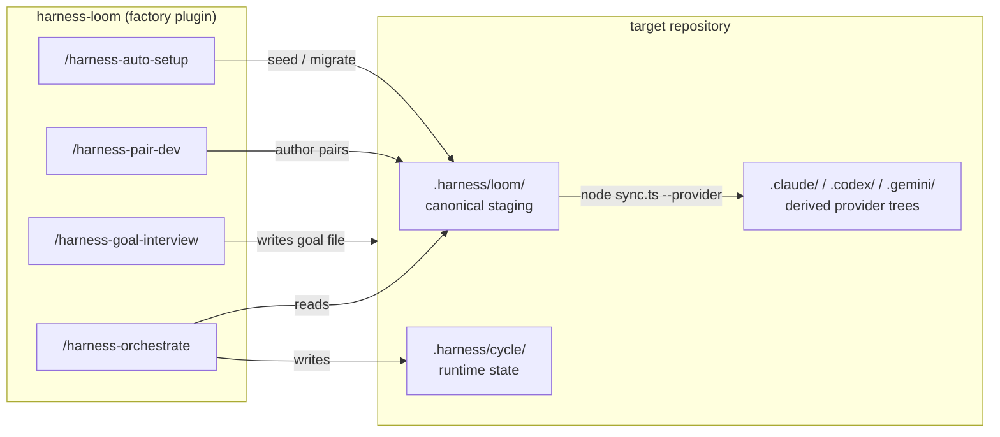

# harness-loom

[English](../README.md) | [한국어](README.ko.md) | [日本語](README.ja.md) | [简体中文](README.zh-CN.md) | [Español](README.es.md)

[](../CHANGELOG.md)
[](../LICENSE)
[](../README.md#multi-platform)

**最新のコーディングアシスタントが標準で出荷する汎用ハーネスの上に、プロダクション特化のハーネスをチューニングしましょう。**

<br clear="left" />

> 表現に齟齬がある場合、正本は [英語版 README](../README.md) です。

## 何をするか

`harness-loom` はターゲットリポジトリにランタイムハーネスをインストールし、プロジェクト固有の producer-reviewer pair をペアごとに育てていくファクトリープラグインです。ファクトリーはユーザーが呼び出すスラッシュコマンドを 4 つ (`/harness-init`、`/harness-auto-setup`、`/harness-pair-dev`、`/harness-goal-interview`) と `sync.ts` スクリプトを出荷します。インストールされると、ターゲットには planner、orchestrator、`.harness/` 配下の共有コントロールプレーン、そして時間とともに追加していくプロジェクト固有の producer-reviewer pair の場所が揃います。

これはモデルのファインチューンではなく、ハーネスのファインチューンです —— リポのレビュー基準、タスク形状、完了の定義を、毎セッションでプロンプトし直す代わりに、バージョン管理されたインフラに刻み込みます。`harness-loom` はアシスタントスタックにすでにプロダクション品質の可能性を見出していて、それをセッションではなくシステムとして振る舞わせたいチームのためのものです。

## クイックスタート

ファクトリーを Claude Code にインストールします。Codex と Gemini も同様のフロー —— [ファクトリーのインストール](#ファクトリーのインストール) を参照してください。

```text
/plugin marketplace add KingGyuSuh/harness-loom
/plugin install harness-loom@harness-loom-marketplace
```

ターゲットリポジトリの中で:

```bash
# 1. .harness/ をシードまたは移行
/harness-auto-setup --setup

# 2. アシスタントランタイムツリーを派生
node .harness/loom/sync.ts --provider claude
#   (マルチプラットフォームには codex,gemini を追加)
```

ここまでが foundation のセットアップです。プロジェクト固有の producer-reviewer pair を追加して最初のサイクルを実行する手順は [ターゲットプロジェクトを始める](#ターゲットプロジェクトを始める) を参照してください。

## どう動くか



ファクトリープラグインはアシスタント CLI の中に存在し、ターゲットリポジトリの中でスラッシュコマンドを実行すると `.harness/loom/` (setup と pair authoring が所有する正本ステージング) と `.harness/cycle/` (orchestrator が所有するランタイム状態) に書き込みます。プラットフォームツリー (`.claude/`、`.codex/`、`.gemini/`) は正本ステージングが変わるたびに `sync.ts` で再派生する成果物 —— 直接編集してはいけません。サイクル終了の **Finalizer** ターンは、ターゲットルートの成果物 (ドキュメント、監査、リリースノート) を `.harness/` の中ではなくターゲットに直接書き込みます。

## なぜこの形なのか

- **Skill-first, agent-second.** 共有方法論はペアごとに 1 つの `SKILL.md` に存在し、プロダクションルールとレビュールールを揃えたまま保ちます。
- **Producer + Reviewers.** 1 つのペアは 1 名または複数の reviewer に fan-out でき、各 reviewer は別の軸で採点します。
- **正本は一度、派生は外へ.** `.harness/loom/` でハーネスを author し、必要なときだけ `.claude/`、`.codex/`、`.gemini/` に派生します。
- **Hook 駆動の実行.** orchestrator は次の dispatch を `.harness/cycle/state.md` に書き込み、hook が手作業の記帳なしにサイクルを再進入させます。
- **リポ anchored authoring.** Pair 生成は実際のターゲットコードベースを読むため、抽象的なボイラープレートではなく実在のファイルとパターンを引用できます。

## インストールされるもの

```text
target project
└── .harness/
    ├── loom/                    # canonical staging (setup + pair authoring own; sync reads)
    │   ├── skills/{harness-orchestrate, harness-planning, harness-context}/
    │   ├── agents/{harness-planner, harness-finalizer}.md
    │   ├── hook.sh
    │   └── sync.ts
    ├── cycle/                   # runtime state (orchestrator owns)
    │   ├── state.md, events.md
    │   └── epics/, finalizer/tasks/
    ├── _snapshots/              # auto-setup provenance (when migration runs)
    └── _archive/                # past cycles (created on goal-different reset)
```

プロジェクトドキュメント (ターゲットルートの `*.md`、`docs/`) は `.harness/` の中ではなく **ターゲットの中に直接** author します。orchestrator は 4 状態 DFA —— `Planner | Pair | Finalizer | Halt` —— として動作します。すべての EPIC が terminal に到達し、planner がそれ以上続行することがなくなったとき、singleton `harness-finalizer` エージェントを dispatch してから停止します; 本文はプロジェクトが必要とするサイクル終了作業 (ドキュメント更新、リクエストカバレッジ点検、リリース準備、監査出力) で置き換えます。

`/harness-auto-setup` はより安全なエントリポイントです: `--setup` (デフォルト) は新規ターゲットをブートストラップするか、既存ハーネスを追加的 (additive) に拡張します; `--migration` はライブの `.harness/loom/` と `.harness/cycle/` をスナップショットし、foundation を更新し、互換性のあるカスタムの pair/finalizer ガイドを保ちます。

## 要件

- **Node.js ≥ 22.6** —— スクリプトはネイティブ TypeScript stripping で実行されます; ビルドステップも `package.json` も不要です。
- **git** —— 生成されたハーネス変更のレビューと、通常の VCS フローによるローカル実験の復元のために推奨されます。
- **少なくとも 1 つのサポート対象アシスタント CLI** が認証済みであること:
  - [Claude Code](https://code.claude.com/docs) —— 主要ターゲット; `.harness/loom/` の正本ステージングは `node .harness/loom/sync.ts --provider claude` で `.claude/` に派生します。
  - [Codex CLI](https://developers.openai.com/codex/cli) —— `node .harness/loom/sync.ts --provider codex` で `.codex/` に派生; 生成された agent TOML は必要な `$skill-name` 本文を明示的に言及します。
  - [Gemini CLI](https://geminicli.com/docs/) —— `node .harness/loom/sync.ts --provider gemini` で `.gemini/` に派生; Gemini frontmatter が `skills:` を拒否するため、生成された agent 本文が必要な skill 名を直接命名します。

## ファクトリーのインストール

実務的には 2 段階のインストールがあります:

1. **ファクトリープラグイン** を Claude Code または Codex CLI にインストール。
2. 各ターゲットリポジトリの中で `/harness-auto-setup --setup`(既存ハーネスの minimal-delta アップグレードには `--migration`)で `.harness/` をシード、点検、または移行し、その後 `node .harness/loom/sync.ts --provider <list>` で実際に使うアシスタント固有のランタイムツリーをデプロイ。

ファクトリーは標準の `plugins/<name>/` モノレポレイアウトで出荷されます —— リポルートに `.claude-plugin/marketplace.json` と `.agents/plugins/marketplace.json` があり、実際のプラグインツリーは `plugins/harness-loom/` 配下にあります。

下から 1 つのファクトリーインストール経路を選んでください。多くのユーザーは Claude Code または Codex CLI からファクトリーをインストールし、ターゲットリポジトリの中で好きなアシスタントから生成されたランタイムを使います。

### Claude Code

ローカル動作確認(ワンショット、マーケットプレースなし):

```bash
claude --plugin-dir ./plugins/harness-loom
```

セッション内マーケットプレース経由の永続インストール。ローカルチェックアウト:

```text
/plugin marketplace add ./
/plugin install harness-loom@harness-loom-marketplace
```

公開 git リポ(GitHub shorthand):

```text
/plugin marketplace add KingGyuSuh/harness-loom
/plugin install harness-loom@harness-loom-marketplace
```

必要に応じて特定タグにピン:

```text
/plugin marketplace add KingGyuSuh/harness-loom@<tag>
/plugin install harness-loom@harness-loom-marketplace
```

### Codex CLI

マーケットプレースソースを追加します —— 引数はリポルート(`.agents/plugins/marketplace.json` を含む)を指します:

```bash
# ローカルチェックアウト
codex plugin marketplace add /path/to/harness-loom

# 公開 git リポ
codex plugin marketplace add KingGyuSuh/harness-loom

# 必要に応じてタグにピン
codex plugin marketplace add KingGyuSuh/harness-loom@<tag>
```

その後、Codex TUI の中で `/plugins` を実行し、`Harness Loom` マーケットプレースエントリーを開いてプラグインをインストールします。

### Gemini Runtime

Claude Code または Codex CLI でファクトリーをインストールしてから、ターゲットプロジェクトの中で `.gemini/` を派生します:

1. Claude Code または Codex CLI からファクトリーをインストールし、ターゲットプロジェクトの中で `/harness-auto-setup --setup --provider gemini` の後 `node .harness/loom/sync.ts --provider gemini` を実行します。これでターゲット側ランタイム(`.harness/loom/`、`.harness/cycle/`、`.gemini/agents/`、`.gemini/skills/`、`AfterAgent` hook が入った `.gemini/settings.json`)がデプロイされます。
2. そのターゲットプロジェクトに `cd` して `gemini` を実行します。CLI はワークスペーススコープの `.gemini/agents/*.md`、`.gemini/skills/<slug>/SKILL.md`、そして `.gemini/settings.json` の `AfterAgent` hook を自動でロードします。
3. orchestrator サイクルが Gemini 上でエンドツーエンドに実行されます —— ファクトリー authoring は Claude/Codex に留まりますが、実行は 3 者のいずれでも可能です。

## ターゲットプロジェクトを始める

アシスタントにファクトリーをインストールしたら、通常のターゲットリポフローは次のとおりです:

1. `/harness-auto-setup --setup` または `/harness-auto-setup --migration` で `.harness/` をシード、プロジェクト形状に合わせた構成、または移行。
2. `sync.ts` で少なくとも 1 つのアシスタントランタイムツリーをデプロイ。
3. リポの最初の producer-reviewer pair を追加。
4. 必要であればサイクル終了 finalizer をカスタマイズ。
5. `/harness-orchestrate <file.md>` を実行。

### 1. ターゲットリポジトリのセットアップまたは移行

ターゲットリポジトリを Claude Code または Codex CLI で開き、次を実行します:

```text
/harness-auto-setup --setup --provider claude
```

更新するプラットフォームツリーを事前に把握しているなら、コンマ区切りの provider リストを使います:

```text
/harness-auto-setup --setup --provider claude,codex,gemini
```

`--setup` は foundation インストーラーを通して新規ターゲットをシードし、具体的なサイクル終了作業が選ばれるまでデフォルトの finalizer を保ちます。新規ターゲットでは pair/finalizer ファイルが author される前にアシスタント側 LLM プロジェクト分析が必要です; docs/tests/CI の存在だけでは `harness-document` や `harness-verification` がもはや作成されません。ターゲットにすでに `.harness/loom/` または `.harness/cycle/` がある場合、`--setup` はスナップショット、reseed、復元、再構成、移行のいずれも行いません; ライブハーネスとリポシグナルを点検した後、プロジェクト分析、必要に応じた簡潔なユーザー質問、`.harness/loom/` 配下の追加的な pair/finalizer authoring へと続きます。

setup モードでの収束ではなく、既存ハーネスの minimal-delta アップグレードを望むなら:

```text
/harness-auto-setup --migration --provider claude
```

移行モードは、互換性のあるリネームやカスタム H2 セクションを含めて、ユーザーが author した pair/finalizer ガイドを可能な限り保ち、必須 frontmatter、`skills:`、Output Format ブロック、finalizer Structural Issue contract のような contract 所有表面を更新します。JSON 要約は source/target overlay プランを含む `convergence.migrationPlan` を含みます。スナップショットはマシン由来の出処と移行の証拠であって、復元される真実の源ではありません。

収束なしに foundation のリセットだけを望むなら:

```text
/harness-init
```

このコマンドは `.harness/loom/` 配下に正本ステージングツリーを、`.harness/cycle/` 配下にランタイム状態 scaffold を書きます。`state.md`、`events.md`、`epics/`、`finalizer/tasks/` をシードしますが、goal/request スナップショットの placeholder、`.claude/`、`.codex/`、`.gemini/` は作成しません。

後で `/harness-init` を再実行した場合、ターゲット側ハーネス scaffolding のリセットとして扱われます: pair が author した `.harness/loom/` の内容と現在の `.harness/cycle/` 状態は保存されず reseed されます。新規ブートストラップや追加的なプロジェクト形状の構成には `/harness-auto-setup --setup` を、既存 foundation の minimal-delta contract 更新には `/harness-auto-setup --migration` を使ってください。

### 2. 実際に使うアシスタントランタイムをデプロイ

正本ステージングから少なくとも 1 つのプラットフォームツリーを派生します:

```bash
node .harness/loom/sync.ts --provider claude
```

マルチプラットフォームデプロイ:

```bash
node .harness/loom/sync.ts --provider claude,codex,gemini
```

pair 編集や finalizer 編集の後はこのコマンドを再実行します。`.harness/loom/` が authoring surface で、`.claude/`、`.codex/`、`.gemini/` は派生出力です。

### 3. 最初のペアを追加

リポで作業が実際に分解される様子に合わせてペアを作ります。正本ペア slug は `harness-` プレフィックスを使い、すべてのペアは少なくとも 1 名の reviewer を含む必要があります。アシスタントは `document` のような短い名前を受け付けるかもしれませんが、生成されるファイルとレジストリエントリは常に `harness-document` として書かれます。

```text
/harness-pair-dev --add harness-game-design "Spec snake.py features and edge cases"
/harness-pair-dev --add harness-impl "Implement snake.py against the spec" --reviewer harness-code-reviewer --reviewer harness-playtest-reviewer
```

ペアの追加、改善、削除の後は `node .harness/loom/sync.ts --provider <list>` を再実行して、プラットフォームツリーが現在のエージェントとスキルを取り込むようにします。

### 4. サイクル終了作業が必要な場合は Finalizer をカスタマイズ

シードされた `.harness/loom/agents/harness-finalizer.md` は安全な no-op です。デフォルトでは `Status: PASS` と `Summary: no cycle-end work registered for this project` を返し、いかなるファイルにも触れません。

サイクルがクリーンに停止することだけを望むならそのまま残します。

次のようなサイクル終了作業が必要なら編集します:

- `CLAUDE.md`、`AGENTS.md`、`docs/` の更新
- `.harness/cycle/events.md` に対する goal カバレッジの点検
- リリースノートや監査成果物の作成
- スキーマや派生レポートのスナップショット

finalizer 本文を編集した後は `sync.ts` を再実行して、更新されたエージェントをプラットフォームツリーにデプロイします。

### 5. 最初のサイクルを実行

リクエストファイルを作成して orchestrator を起動します:

```bash
cat > goal.md <<'EOF'
Ship a lightweight terminal Snake game with curses
EOF

/harness-orchestrate goal.md
```

成果物は `.harness/cycle/epics/EP-N--<slug>/{tasks,reviews}/` 配下に着地します。ランタイム状態は `.harness/cycle/state.md` に、元のリクエスト全体は `.harness/cycle/user-request-snapshot.md` に、append-only のイベントログは `.harness/cycle/events.md` に存在します。すべてのライブ EPIC が terminal に到達し、planner がそれ以上続行することがなくなったとき、orchestrator が **Finalizer 状態** に入って singleton `harness-finalizer` を実行してから停止します。

## 通常カスタマイズするもの

ほとんどのユーザーは 3 つだけカスタマイズすれば十分です:

- **Pair** —— リポの実際の作業分解とレビュー軸を反映するまで、producer-reviewer pair を追加、改善、削除します。1 つのペアが 2 つの異なる仕事になっていたら、置き換えを明示的に追加/改善してから古いペアを削除します。
- **Finalizer 本文** —— プロジェクトがターゲットルートでサイクル終了作業を必要とする場合だけデフォルトの no-op を置き換えます。
- **サイクルリクエストファイル** —— 各サイクルはユーザーが author したリクエストファイル(多くは `goal.md`)から始まります。orchestrator は完全な本文を `.harness/cycle/user-request-snapshot.md` に保存し、dispatch envelope に `User request snapshot` としてそのパスを渡します; `Goal` は圧縮された要約として保たれます。

ほとんどのユーザーが手で編集すべきで **ない** もの:

- `harness-orchestrate`
- `harness-planning`
- `harness-context`
- `.harness/cycle/state.md`
- `.harness/cycle/events.md`

ハーネス contract そのものを意図的に変える場合を除き、上記はランタイムインフラとして扱ってください。

## 概念

コマンド、ファイル、状態の間で繰り返し現れるいくつかの用語があります。これだけ知っていれば、リポの残りを読めます:

- **Harness** —— アシスタントを取り囲む永続レイヤー: 状態ファイル、hook、subagent、contract。`harness-loom` はこのレイヤーをあなたのリポに合わせて形作ります。
- **Pair** —— 1 名の **producer** と 1 名以上の **reviewer** が単一の `SKILL.md` を共有する単位。ドメイン作業の authoring 単位です。
- **Producer** —— タスクのために作業(コード、スペック、分析を書く)を行い、タスク成果物を返す subagent。その `Status` は自己報告にすぎず、Pair verdict は reviewer が決めます。
- **Reviewer** —— producer の出力を特定の軸(コード品質、スペック適合度、セキュリティなど)で採点する subagent。1 つのペアは複数の reviewer に fan-out でき、各々が独立に採点され、その `Verdict` 値が Pair ターン verdict の load-bearing なソースになります。
- **EPIC / Task** —— EPIC は planner が産出する成果単位、Task はその EPIC の中の単一の producer-reviewer ラウンド。成果物は `.harness/cycle/epics/EP-N--<slug>/{tasks,reviews}/` 配下に着地します。
- **Orchestrator vs Planner** —— **orchestrator** は `.harness/cycle/state.md` を所有し 4 状態 DFA(`Planner | Pair | Finalizer | Halt`)として動作し、応答ごとに正確に 1 名の producer を dispatch します(Pair ターンは producer + 1 〜 M 名の reviewer を並列実行、Finalizer ターンは reviewer なしで単一のサイクル終了エージェントを実行)。**planner** はそのループの中で goal を EPIC に分解し、各 EPIC に適用可能な固定のグローバル roster の一部を選び、EPIC 間の同一ステージ upstream gate を宣言します。
- **Finalizer** —— サイクル終了 hook。ランタイムは、すべての EPIC が terminal で planner の継続がなくなったときに動く singleton `harness-finalizer` エージェントを 1 つ出荷します。ペア reviewer は持たず、verdict は finalizer 自身の `Status` と機械的な `Self-verification` 証拠です。シードされたデフォルトの `harness-finalizer` は generic skeleton です; プロジェクトが必要とする具体的なサイクル終了作業で本文を置き換えます。

## コマンド

| コマンド | 目的 |
|---------|---------|
| `/harness-init` | 現在の作業ディレクトリに正本 `.harness/loom/` ステージングツリーと `.harness/cycle/` ランタイム状態をスキャフォールドします。ランタイム skill、`harness-planner` エージェント、generic `harness-finalizer` サイクル終了 skeleton、そして `.harness/loom/` 配下の自己完結 `hook.sh` + `sync.ts` コピーを書きます。`state.md`、`events.md`、`epics/`、`finalizer/tasks/` をシードしますが、goal や request スナップショット placeholder は作成しません。再実行は両ネームスペースを reseed します。プラットフォームツリーには触れません。 |
| `/harness-auto-setup [--setup \| --migration] [--provider <list>]` | 現在の作業ディレクトリのハーネスを安全にセットアップ、設定、または移行します。`--setup`(デフォルト)は新規ターゲットをブートストラップし、stock な docs/tests pair を作る代わりに pair/finalizer ファイル author 前にアシスタント側プロジェクト分析を要求します; 既存ターゲットでは foundation ファイルを残したまま、ユーザーが改善を要求しない限り追加的なプロジェクト形状 authoring のみを行います。`--migration` は既存ハーネスの minimal-delta アップグレードを行います: まずスナップショット、foundation 更新、カスタム loom 項目の復元、そして contract 所有のランタイム表面のみを書き直しつつ pair/finalizer ガイドを保ち、移行プランを発行します。両モードとも明示的な sync コマンドで停止し、プラットフォームツリーには触れません。 |
| `node .harness/loom/sync.ts --provider <list>` | 正本 `.harness/loom/` をプラットフォームツリー(`.claude/`、`.codex/`、`.gemini/`)にデプロイします。一方向で、`.harness/loom/` には決して書き戻しません。provider 選択は明示的です: provider フラグなしの bare 呼び出しはエラーです。Claude は agent `skills:` frontmatter を保持し、Codex と Gemini は生成された agent 本文に必要な skill ロードプロンプトを受け取ります。 |
| `/harness-pair-dev --add <slug> "<purpose>" [--from <source>] [--reviewer <slug> ...] [--before <slug> \| --after <slug>]` | 現在のコードベースに anchored された新しい producer-reviewer pair を author します。`<purpose>` は必須です。`--from` は現在登録されているライブペア slug、またはターゲットローカルの `snapshot:<ts>/<pair>` / `archive:<ts>/<pair>` ロケーターを template-first overlay ソースとして受け取ります: 現在のハーネス形状を固定したまま、互換性のある source ドメインガイドを保ちます。任意のファイルシステムパスや provider ツリーインポートではありません。デフォルトは 1:1 で、1:N reviewer トポロジーには `--reviewer` を繰り返します。authoring は `.harness/loom/` のみに書きます; その後 `node .harness/loom/sync.ts --provider <list>` を再実行してください。 |
| `/harness-pair-dev --improve <slug> "<purpose>" [--before <slug> \| --after <slug>]` | positional `<purpose>` を主な改訂軸として登録済みペアを改善し、その後 rubric 整備と現在のリポ証拠を取り込みます。1 つのペアが 2 つの異なる仕事になっていたら、明示的な add/improve/remove ステップを使ってください。その後 sync を再実行してプラットフォームツリーを更新してください。 |
| `/harness-pair-dev --remove <slug>` | ペアを安全に登録解除し、ペア所有の `.harness/loom/` ファイルだけを削除します。変異前に foundation/singleton ターゲットや、`## Next` または ライブ EPIC roster/current フィールドの active-cycle 参照を拒否し、`.harness/cycle/` の task/review 履歴を保ち、いかなる provider ツリーにも触れません; その後 sync を再実行してください。 |
| `/harness-orchestrate <file.md>` | ターゲット側ランタイムエントリポイント。リクエストファイルを読み、その完全な本文を `.harness/cycle/user-request-snapshot.md` に保存し、応答ごとに正確に 1 名の producer を dispatch する 4 状態 DFA(`Planner | Pair | Finalizer | Halt`)を実行します; hook 再進入は `state.md` と既存のスナップショットパスからサイクルを進めます。すべての EPIC が terminal に到達し planner の継続性が明確なとき、orchestrator は Finalizer 状態に入って singleton `harness-finalizer` を dispatch してから停止します。 |

## マルチプラットフォーム

`sync.ts` が適用するプラットフォームピン:

| プラットフォーム | モデル | Hook イベント | 備考 |
|----------|-------|------------|-------|
| Claude | `inherit` | `Stop` | `.claude/settings.json` が `.harness/loom/hook.sh` をトリガします。 |
| Codex | `gpt-5.5`, `model_reasoning_effort: xhigh` | `Stop` | Agent TOML が必要な `$skill-name` 言及を `developer_instructions` の前に prepend します; skill は `.codex/skills/` 配下にミラーされます。 |
| Gemini | `gemini-3.1-pro-preview` | `AfterAgent` | Agent 本文が必要な skill を命名します; skill は `.gemini/skills/` 配下にミラーされます。 |

## いつ使うか

`harness-loom` は次のときに使ってください:

- 基本のアシスタント環境がすでにあなたのリポで実際の作業をするだけ十分強力で
- 残るギャップが再現性、レビュー構造、状態の連続性、ドメイン適合性で
- ハーネスルールが場当たりの再プロンプトではなくバージョン管理されたファイルに存在することを望み
- 決定的なマルチプラットフォーム派生を持つ単一の正本 authoring surface を望むとき

基盤となるモデルスタックがあなたの作業を扱えるかどうかをまだ評価中なら、手を出さないでください。このプロジェクトは generic ハーネスがすでに有用であることを前提とし、それをプロダクション特化システムへと形作ることに集中します。

## 貢献

イシュー、バグフィックス、rubric の洗練を歓迎します。dev ループ、smoke-test コマンド、スコープガイダンス(新しいユーザー呼び出し可能 skill や orchestrator リズムの変更は discussion から始まります)については [CONTRIBUTING.md](../CONTRIBUTING.md) を見てください。セキュリティ報告は [SECURITY.md](../SECURITY.md) を見てください。すべての参加は [Code of Conduct](../CODE_OF_CONDUCT.md) によって統治されます。

## プロジェクトドキュメント

- [CHANGELOG.md](../CHANGELOG.md) - リリース履歴
- [CONTRIBUTING.md](../CONTRIBUTING.md) - 開発セットアップと PR フロー
- [SECURITY.md](../SECURITY.md) - 責任ある開示
- [CODE_OF_CONDUCT.md](../CODE_OF_CONDUCT.md) - コミュニティの期待事項
- [LICENSE](../LICENSE) - Apache 2.0
- [NOTICE](../NOTICE) - Apache 2.0 が要求する帰属表示
