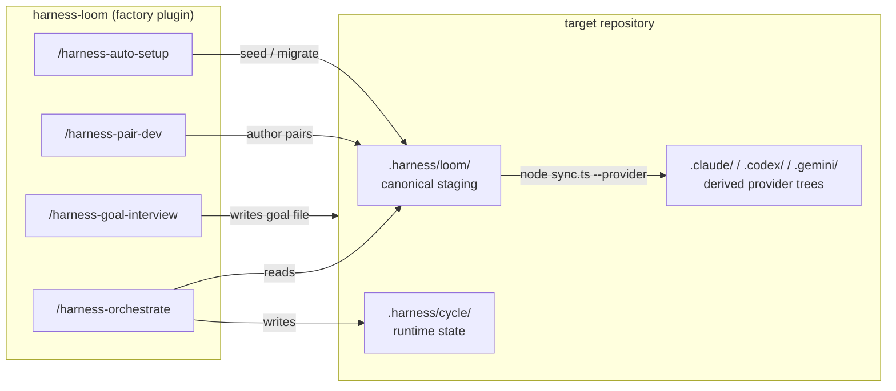

# harness-loom

[English](../README.md) | [한국어](README.ko.md) | [日本語](README.ja.md) | [简体中文](README.zh-CN.md) | [Español](README.es.md)

[](../CHANGELOG.md)
[](../LICENSE)
[](../README.md#multi-platform)

**최신 코딩 어시스턴트가 기본 제공하는 범용 하네스 위에, 프로덕션 특화 하네스를 올려서 길들이세요.**

<br clear="left" />

> 표현이 충돌할 경우 [영문 README](../README.md) 가 정본입니다.

## 무엇을 하는가

`harness-loom` 은 타깃 리포지토리에 런타임 하네스를 설치하고, 프로젝트 고유의 producer-reviewer pair를 점진적으로 키워 나가는 팩토리 플러그인입니다. 팩토리는 사용자가 호출하는 슬래시 커맨드 4개 (`/harness-init`, `/harness-auto-setup`, `/harness-pair-dev`, `/harness-goal-interview`) 와 `sync.ts` 스크립트를 출하합니다. 설치되면 타깃은 planner, orchestrator, `.harness/` 아래의 공유 컨트롤 플레인, 그리고 시간이 지나며 추가하는 프로젝트 고유 producer-reviewer pair 자리를 갖게 됩니다.

이것은 모델 파인튜닝이 아닌 하네스 파인튜닝입니다 — 리포의 리뷰 기준, 작업 형태, "완료" 정의를 매 세션마다 재프롬프팅하는 대신 버전 관리되는 인프라에 인코딩합니다. `harness-loom` 은 어시스턴트 스택의 프로덕션 품질 가능성을 이미 확인했고, 그것이 세션이 아닌 시스템처럼 동작하길 원하는 팀을 위한 것입니다.

## 빠른 시작

팩토리를 Claude Code (또는 Codex / Gemini — 전체 옵션은 [팩토리 설치](#팩토리-설치) 참고) 에 설치합니다:

```text
/plugin marketplace add KingGyuSuh/harness-loom
/plugin install harness-loom@harness-loom-marketplace
```

타깃 리포지토리 안에서:

```bash
# 1. .harness/ 시드 또는 마이그레이션
/harness-auto-setup --setup

# 2. 어시스턴트 런타임 트리 파생
node .harness/loom/sync.ts --provider claude
#   (멀티 플랫폼은 codex,gemini 추가)
```

여기까지가 foundation 셋업입니다. 프로젝트 고유 producer-reviewer pair 추가와 첫 사이클 실행은 [타깃 프로젝트 시작하기](#타깃-프로젝트-시작하기) 를 보세요.

## 동작 방식



팩토리 플러그인은 어시스턴트 CLI 안에 살고, 타깃 리포지토리 안에서 슬래시 커맨드를 실행하면 `.harness/loom/` (setup 과 pair authoring 이 소유하는 정본 staging) 과 `.harness/cycle/` (orchestrator 가 소유하는 런타임 상태) 에 작성합니다. 플랫폼 트리 (`.claude/`, `.codex/`, `.gemini/`) 는 정본 staging이 변할 때마다 `sync.ts` 로 다시 파생하는 산출물 — 직접 편집하지 마세요. 사이클 종료의 **Finalizer** 턴은 타깃 루트 산출물 (문서, 감사, 릴리스 노트) 을 `.harness/` 안이 아닌 타깃에 직접 작성합니다.

## 왜 이 모양인가

- **Skill-first, agent-second.** 공유 방법론은 pair마다 하나의 `SKILL.md` 에 살아 있어, 프로덕션 규칙과 리뷰 규칙이 정렬을 유지합니다.
- **Producer + Reviewers.** 한 pair는 한 명 또는 여러 명의 reviewer로 fan-out 할 수 있고, 각 reviewer는 별개의 축으로 채점합니다.
- **정본은 한 번, 파생은 외부로.** `.harness/loom/` 에서 하네스를 저자(author) 하고, 원할 때만 `.claude/`, `.codex/`, `.gemini/` 로 파생합니다.
- **Hook 주도 실행.** orchestrator는 다음 dispatch를 `.harness/cycle/state.md` 에 기록하고, hook이 수동 부기 없이 사이클을 재진입시킵니다.
- **리포 anchored authoring.** Pair 생성은 실제 타깃 코드베이스를 읽기 때문에 추상적인 보일러플레이트가 아닌 실제 파일과 패턴을 인용할 수 있습니다.

## 무엇이 설치되는가

```text
target project
└── .harness/
    ├── loom/                    # canonical staging (setup + pair authoring own; sync reads)
    │   ├── skills/{harness-orchestrate, harness-planning, harness-context}/
    │   ├── agents/{harness-planner, harness-finalizer}.md
    │   ├── hook.sh
    │   └── sync.ts
    ├── cycle/                   # runtime state (orchestrator owns)
    │   ├── state.md, events.md
    │   └── epics/, finalizer/tasks/
    ├── _snapshots/              # auto-setup provenance (when migration runs)
    └── _archive/                # past cycles (created on goal-different reset)
```

프로젝트 문서 (타깃 루트의 `*.md`, `docs/`) 는 `.harness/` 안이 아닌 **타깃 안에 직접** 작성합니다. orchestrator는 4-state DFA — `Planner | Pair | Finalizer | Halt` — 로 동작합니다. 모든 EPIC이 terminal에 도달하고 planner가 더 이어갈 게 없을 때, singleton `harness-finalizer` 에이전트를 dispatch한 뒤 정지합니다; 본문은 프로젝트가 필요로 하는 사이클 종료 작업 (문서 갱신, request coverage 점검, 릴리스 준비, 감사 출력) 으로 교체합니다.

`/harness-auto-setup` 은 더 안전한 진입점입니다: `--setup` (기본) 은 fresh target을 부트스트랩하거나 기존 하네스를 추가적(additive) 으로 확장합니다; `--migration` 은 라이브 `.harness/loom/` 과 `.harness/cycle/` 을 스냅샷하고, foundation을 갱신하고, 호환되는 사용자 정의 pair/finalizer 가이드를 보존합니다.

## 요구사항

- **Node.js ≥ 22.6** — 스크립트는 네이티브 TypeScript stripping으로 실행됩니다; 빌드 단계도 `package.json` 도 없습니다.
- **git** — 생성된 하네스 변경사항 검토와 일반 VCS 흐름을 통한 로컬 실험 복구를 위해 권장됩니다.
- **하나 이상의 지원 어시스턴트 CLI**, 인증된 상태:
  - [Claude Code](https://code.claude.com/docs) — 주 타깃; `.harness/loom/` 의 정본 staging은 `node .harness/loom/sync.ts --provider claude` 로 `.claude/` 에 파생됩니다.
  - [Codex CLI](https://developers.openai.com/codex/cli) — `node .harness/loom/sync.ts --provider codex` 로 `.codex/` 에 파생; 생성된 agent TOML은 필요한 `$skill-name` 본문을 명시적으로 언급합니다.
  - [Gemini CLI](https://geminicli.com/docs/) — `node .harness/loom/sync.ts --provider gemini` 로 `.gemini/` 에 파생; Gemini frontmatter가 `skills:` 를 거부하므로 생성된 agent 본문이 필요한 skill 이름을 직접 명명합니다.

## 팩토리 설치

실무상 두 단계의 설치가 있습니다:

1. **팩토리 플러그인** 을 Claude Code 또는 Codex CLI에 설치.
2. 각 타깃 리포지토리 안에서 `/harness-auto-setup --setup` (기존 하네스의 minimal-delta 업그레이드는 `--migration`) 으로 `.harness/` 를 시드, 점검, 또는 마이그레이션한 다음, `node .harness/loom/sync.ts --provider <list>` 로 실제로 사용할 어시스턴트별 런타임 트리를 배포.

팩토리는 표준 `plugins/<name>/` monorepo 레이아웃으로 출하됩니다 — 리포 루트에 `.claude-plugin/marketplace.json` 과 `.agents/plugins/marketplace.json` 이 있고, 실제 플러그인 트리는 `plugins/harness-loom/` 아래에 있습니다.

아래에서 팩토리 설치 경로 하나를 선택하세요. 대부분 사용자는 Claude Code 또는 Codex CLI에서 팩토리를 설치한 뒤, 타깃 리포지토리 안에서 원하는 어떤 어시스턴트에서든 생성된 런타임을 사용합니다.

### Claude Code

로컬 검증(일회성, 마켓플레이스 없이):

```bash
claude --plugin-dir ./plugins/harness-loom
```

세션 내 마켓플레이스를 통한 영속 설치. 로컬 체크아웃:

```text
/plugin marketplace add ./
/plugin install harness-loom@harness-loom-marketplace
```

공개 git 리포(GitHub shorthand):

```text
/plugin marketplace add KingGyuSuh/harness-loom
/plugin install harness-loom@harness-loom-marketplace
```

필요하면 특정 태그 핀:

```text
/plugin marketplace add KingGyuSuh/harness-loom@<tag>
/plugin install harness-loom@harness-loom-marketplace
```

### Codex CLI

마켓플레이스 소스를 추가합니다 — 인자는 리포 루트(`/.agents/plugins/marketplace.json` 포함) 를 가리킵니다:

```bash
# 로컬 체크아웃
codex marketplace add /path/to/harness-loom

# 공개 git 리포
codex marketplace add KingGyuSuh/harness-loom

# 필요하면 태그 핀
codex marketplace add KingGyuSuh/harness-loom@<tag>
```

그런 다음 Codex TUI 안에서 `/plugins` 를 실행하고 `Harness Loom` 마켓플레이스 항목을 열어 플러그인을 설치합니다.

### Gemini Runtime

Claude Code 또는 Codex CLI로 팩토리를 설치한 다음, 타깃 프로젝트 안에서 `.gemini/` 를 파생합니다:

1. Claude Code 또는 Codex CLI에서 팩토리를 설치하고, 타깃 프로젝트 안에서 `/harness-auto-setup --setup --provider gemini` 다음 `node .harness/loom/sync.ts --provider gemini` 를 실행합니다. 이렇게 하면 타깃 측 런타임(`.harness/loom/`, `.harness/cycle/`, `.gemini/agents/`, `.gemini/skills/`, `AfterAgent` hook이 포함된 `.gemini/settings.json`) 이 배포됩니다.
2. 그 타깃 프로젝트로 `cd` 한 뒤 `gemini` 를 실행합니다. CLI는 워크스페이스 스코프의 `.gemini/agents/*.md`, `.gemini/skills/<slug>/SKILL.md`, 그리고 `.gemini/settings.json` 의 `AfterAgent` hook을 자동으로 로드합니다.
3. orchestrator 사이클이 Gemini에서 끝까지 실행됩니다 — 팩토리 authoring은 Claude/Codex에 머물지만 실행은 셋 중 어느 것이든 가능합니다.

## 타깃 프로젝트 시작하기

어시스턴트에 팩토리를 설치한 뒤의 일반적인 타깃 리포 흐름은 다음과 같습니다:

1. `/harness-auto-setup --setup` 또는 `/harness-auto-setup --migration` 으로 `.harness/` 를 시드, 프로젝트 형태에 맞춰 구성, 또는 마이그레이션.
2. `sync.ts` 로 최소 하나의 어시스턴트 런타임 트리를 배포.
3. 리포의 첫 producer-reviewer pair를 추가.
4. 필요하면 사이클 종료 finalizer를 커스터마이즈.
5. `/harness-orchestrate <file.md>` 실행.

### 1. 타깃 리포지토리 셋업 또는 마이그레이션

타깃 리포지토리를 Claude Code 또는 Codex CLI에서 열고 다음을 실행합니다:

```text
/harness-auto-setup --setup --provider claude
```

갱신할 플랫폼 트리를 미리 알고 있으면 콤마 구분 provider 리스트를 사용합니다:

```text
/harness-auto-setup --setup --provider claude,codex,gemini
```

`--setup` 은 foundation 설치자를 거쳐 fresh target을 시드하고, 구체적 사이클 종료 작업이 선택될 때까지 default finalizer를 유지합니다. Fresh target은 pair/finalizer 파일이 작성되기 전에 어시스턴트 측 LLM 프로젝트 분석을 요구합니다; docs/tests/CI 존재만으로는 더 이상 `harness-document` 나 `harness-verification` 이 생성되지 않습니다. 타깃에 이미 `.harness/loom/` 또는 `.harness/cycle/` 이 있으면, `--setup` 은 스냅샷, reseed, 복원, 재구성, 마이그레이션을 하지 않습니다; 라이브 하네스와 리포 신호를 점검한 뒤 프로젝트 분석, 필요한 짧은 사용자 질문, 그리고 `.harness/loom/` 아래의 추가적인 pair/finalizer authoring으로 이어집니다.

setup 모드 수렴 대신 기존 하네스의 minimal-delta 업그레이드를 원할 때:

```text
/harness-auto-setup --migration --provider claude
```

마이그레이션 모드는 호환되는 이름 변경 또는 사용자 정의 H2 섹션을 포함해 사용자가 작성한 pair/finalizer 가이드를 가능한 한 보존하고, 필수 frontmatter, `skills:`, Output Format 블록, finalizer Structural Issue contract 같은 contract 소유 표면을 갱신합니다. JSON 요약은 source/target overlay 계획을 담은 `convergence.migrationPlan` 을 포함합니다. 스냅샷은 머신 출처와 마이그레이션 증거이지, 복원된 진실의 원천이 아닙니다.

수렴 없이 foundation 리셋만 원하면:

```text
/harness-init
```

이 명령은 `.harness/loom/` 아래에 정본 staging tree를, `.harness/cycle/` 아래에 런타임 상태 scaffold를 작성합니다. `state.md`, `events.md`, `epics/`, `finalizer/tasks/` 를 시드합니다; goal/request 스냅샷 placeholder, `.claude/`, `.codex/`, `.gemini/` 는 만들지 않습니다.

나중에 `/harness-init` 을 다시 실행하면, 타깃 측 하네스 scaffolding의 리셋으로 처리됩니다: pair가 작성한 `.harness/loom/` 콘텐츠와 현재 `.harness/cycle/` 상태는 보존되지 않고 reseed됩니다. fresh 부트스트랩이나 추가적인 프로젝트 형태 구성에는 `/harness-auto-setup --setup` 을, 기존 foundation의 minimal-delta contract 갱신에는 `/harness-auto-setup --migration` 을 사용하세요.

### 2. 실제로 사용할 어시스턴트 런타임 배포

정본 staging에서 최소 하나의 플랫폼 트리를 파생합니다:

```bash
node .harness/loom/sync.ts --provider claude
```

멀티 플랫폼 배포:

```bash
node .harness/loom/sync.ts --provider claude,codex,gemini
```

pair 편집이나 finalizer 편집 후에는 이 명령을 다시 실행합니다. `.harness/loom/` 은 authoring surface이고, `.claude/`, `.codex/`, `.gemini/` 는 파생 결과입니다.

### 3. 첫 pair 추가

리포에서 작업이 실제로 분해되는 방식에 맞춰 pair를 만듭니다. 정본 pair slug는 `harness-` 접두사를 사용하고, 모든 pair는 최소 한 명의 reviewer를 포함해야 합니다. 어시스턴트가 `document` 같은 짧은 이름을 받아들일 수 있지만, 생성되는 파일과 registry 항목은 항상 `harness-document` 로 작성됩니다.

```text
/harness-pair-dev --add harness-game-design "Spec snake.py features and edge cases"
/harness-pair-dev --add harness-impl "Implement snake.py against the spec" --reviewer harness-code-reviewer --reviewer harness-playtest-reviewer
```

pair를 추가, 개선, 또는 제거한 뒤에는 `node .harness/loom/sync.ts --provider <list>` 를 다시 실행해 플랫폼 트리가 현재 agent와 skill을 반영하게 합니다.

### 4. 사이클 종료 작업이 필요하면 Finalizer 커스터마이즈

시드된 `.harness/loom/agents/harness-finalizer.md` 는 안전한 no-op 입니다. 기본값으로 `Status: PASS`, `Summary: no cycle-end work registered for this project` 를 반환하고 어떤 파일도 건드리지 않습니다.

사이클이 깨끗하게 정지하기만 원하면 그대로 두세요.

다음과 같은 사이클 종료 작업이 필요하면 편집하세요:

- `CLAUDE.md`, `AGENTS.md`, `docs/` 갱신
- `.harness/cycle/events.md` 에 대비한 goal 커버리지 점검
- 릴리스 노트나 감사 산출물 작성
- 스키마 또는 파생 보고서 스냅샷

finalizer 본문 편집 후에는 `sync.ts` 를 다시 실행해 갱신된 agent를 플랫폼 트리에 배포합니다.

### 5. 첫 사이클 실행

request 파일을 만들고 orchestrator를 시작합니다:

```bash
cat > goal.md <<'EOF'
Ship a lightweight terminal Snake game with curses
EOF

/harness-orchestrate goal.md
```

산출물은 `.harness/cycle/epics/EP-N--<slug>/{tasks,reviews}/` 아래에 떨어집니다. 런타임 상태는 `.harness/cycle/state.md` 에, 원본 request 전체는 `.harness/cycle/user-request-snapshot.md` 에, append-only 이벤트 로그는 `.harness/cycle/events.md` 에 살아 있습니다. 모든 라이브 EPIC이 terminal에 도달하고 planner가 더 이어갈 게 없을 때, orchestrator가 **Finalizer 상태** 에 진입해 singleton `harness-finalizer` 를 실행한 뒤 정지합니다.

## 보통 커스터마이즈하는 것

대부분 사용자는 세 가지만 커스터마이즈하면 됩니다:

- **Pair** — 리포의 실제 작업 분해와 리뷰 축이 반영될 때까지 producer-reviewer pair를 추가, 개선, 제거합니다. 한 pair가 두 개의 다른 일이 됐다면 교체본을 명시적으로 추가/개선한 뒤 옛 pair를 제거합니다.
- **Finalizer 본문** — 프로젝트가 타깃 루트에서 사이클 종료 작업을 필요로 할 때만 default no-op을 교체합니다.
- **사이클 request 파일** — 각 사이클은 사용자가 작성한 request 파일(보통 `goal.md`) 에서 시작합니다. orchestrator는 전체 본문을 `.harness/cycle/user-request-snapshot.md` 에 보존하고, dispatch envelope에 `User request snapshot` 으로 그 경로를 전달합니다; `Goal` 은 압축 요약으로 유지됩니다.

대부분 사용자가 손으로 편집하면 **안 되는** 것들:

- `harness-orchestrate`
- `harness-planning`
- `harness-context`
- `.harness/cycle/state.md`
- `.harness/cycle/events.md`

하네스 contract 자체를 의도적으로 바꾸는 경우가 아니면 위 항목들은 런타임 인프라로 다루세요.

## 개념

명령, 파일, 상태에서 반복되는 몇몇 용어가 있습니다. 이 정도만 알아도 리포의 나머지를 읽을 수 있습니다:

- **Harness** — 어시스턴트를 둘러싼 영속 레이어: 상태 파일, hook, subagent, contract. `harness-loom` 은 이 레이어를 여러분의 리포에 맞게 만듭니다.
- **Pair** — 한 명의 **producer** 와 한 명 이상의 **reviewer** 가 단일 `SKILL.md` 를 공유한 단위. 도메인 작업의 authoring 단위입니다.
- **Producer** — 작업을 수행해 산출물을 반환하는(코드, 스펙, 분석 작성) subagent. 그 `Status` 는 자기 보고이며, Pair verdict는 reviewer가 결정합니다.
- **Reviewer** — producer 출력을 특정 축(코드 품질, 스펙 적합도, 보안 등)으로 채점하는 subagent. 한 pair는 여러 reviewer로 fan-out 할 수 있고 각각 독립 채점되며, 그들의 `Verdict` 값이 Pair 턴 verdict의 load-bearing 출처입니다.
- **EPIC / Task** — EPIC은 planner가 산출하는 결과 단위, Task는 그 EPIC 안의 단일 producer-reviewer 라운드. 산출물은 `.harness/cycle/epics/EP-N--<slug>/{tasks,reviews}/` 아래에 떨어집니다.
- **Orchestrator vs Planner** — **orchestrator** 는 `.harness/cycle/state.md` 를 소유하고 4-state DFA(`Planner | Pair | Finalizer | Halt`) 로 동작하며, 응답마다 정확히 한 명의 producer를 dispatch합니다(Pair 턴은 producer + 1~M명의 reviewer를 병렬로 실행, Finalizer 턴은 reviewer 없이 단일 사이클 종료 agent 실행). **planner** 는 그 루프 안에서 goal을 EPIC으로 분해하고, 각 EPIC에 적용 가능한 고정 글로벌 roster 일부를 선택하고, EPIC 간 동일 stage upstream gate를 선언합니다.
- **Finalizer** — 사이클 종료 hook. 런타임은 모든 EPIC이 terminal이고 planner 연속이 없을 때 실행되는 singleton `harness-finalizer` agent 하나를 출하합니다. 짝 reviewer가 없으며, verdict는 finalizer 자신의 `Status` 와 기계적 `Self-verification` 증거입니다. 시드된 default `harness-finalizer` 는 generic skeleton입니다; 프로젝트가 필요한 구체적 사이클 종료 작업으로 본문을 교체합니다.

## 명령

| 명령 | 목적 |
|---------|---------|
| `/harness-init` | 현재 작업 디렉터리에 정본 `.harness/loom/` staging tree와 `.harness/cycle/` 런타임 상태를 스캐폴드합니다. 런타임 skill, `harness-planner` agent, generic `harness-finalizer` 사이클 종료 skeleton, 그리고 `.harness/loom/` 아래의 자체 포함 `hook.sh` + `sync.ts` 사본을 작성합니다. `state.md`, `events.md`, `epics/`, `finalizer/tasks/` 를 시드하지만 goal이나 request 스냅샷 placeholder는 만들지 않습니다. 재실행 시 두 네임스페이스를 reseed합니다. 어떤 플랫폼 트리도 건드리지 않습니다. |
| `/harness-auto-setup [--setup \| --migration] [--provider <list>]` | 현재 작업 디렉터리의 하네스를 안전하게 셋업, 구성, 또는 마이그레이션합니다. `--setup` (기본) 은 fresh target을 부트스트랩하고, stock docs/tests pair를 만드는 대신 pair/finalizer 파일 작성 전에 어시스턴트 측 프로젝트 분석을 요구합니다; 기존 타깃에서는 foundation 파일을 그대로 두고 사용자가 개선을 요청하지 않는 한 추가적인 프로젝트 형태 authoring만 수행합니다. `--migration` 은 기존 하네스의 minimal-delta 업그레이드를 수행합니다: 먼저 스냅샷, foundation 갱신, 사용자 정의 loom 항목 복원, 그리고 contract 소유 런타임 표면만 다시 작성하면서 pair/finalizer 가이드는 보존하고, 마이그레이션 계획을 산출합니다. 두 모드 모두 명시적 sync 명령으로 끝나고 어떤 플랫폼 트리도 건드리지 않습니다. |
| `node .harness/loom/sync.ts --provider <list>` | 정본 `.harness/loom/` 을 플랫폼 트리(`.claude/`, `.codex/`, `.gemini/`) 에 배포합니다. 단방향이며 `.harness/loom/` 으로는 절대 되쓰지 않습니다. provider 선택은 명시적입니다: provider 플래그 없는 bare 호출은 에러입니다. Claude는 agent `skills:` frontmatter를 유지하고, Codex와 Gemini는 생성된 agent 본문에서 필요한 skill 로딩 프롬프트를 받습니다. |
| `/harness-pair-dev --add <slug> "<purpose>" [--from <source>] [--reviewer <slug> ...] [--before <slug> \| --after <slug>]` | 현재 코드베이스에 anchored된 새 producer-reviewer pair를 author합니다. `<purpose>` 는 필수입니다. `--from` 은 현재 등록된 라이브 pair slug 또는 타깃 로컬 `snapshot:<ts>/<pair>` / `archive:<ts>/<pair>` locator 를 template-first overlay 소스로 받습니다: 현재 하네스 형태는 고정한 채 호환되는 source 도메인 가이드를 보존합니다. 임의의 파일시스템 경로나 provider 트리 임포트가 아닙니다. 기본은 1:1; 1:N reviewer 토폴로지는 `--reviewer` 를 반복합니다. authoring은 `.harness/loom/` 에만 작성합니다; 이후 `node .harness/loom/sync.ts --provider <list>` 를 다시 실행하세요. |
| `/harness-pair-dev --improve <slug> "<purpose>" [--before <slug> \| --after <slug>]` | positional `<purpose>` 를 주된 개정 축으로 등록된 pair를 개선하고, 그 다음 rubric 정비와 현재 리포 증거를 접목합니다. 한 pair가 두 개의 다른 일이 됐다면 명시적인 add/improve/remove 단계를 사용하세요. 이후 sync를 다시 실행해 플랫폼 트리를 갱신하세요. |
| `/harness-pair-dev --remove <slug>` | pair를 안전하게 등록 해제하고 pair 소유의 `.harness/loom/` 파일만 삭제합니다. 변형 전 foundation/singleton 타깃과 `## Next` 또는 라이브 EPIC roster/current 필드의 active-cycle 참조를 거부하고, `.harness/cycle/` task/review 히스토리는 보존하며, 어떤 provider 트리도 건드리지 않습니다; 이후 sync를 다시 실행하세요. |
| `/harness-orchestrate <file.md>` | 타깃 측 런타임 진입점. request 파일을 읽고 그 전체 본문을 `.harness/cycle/user-request-snapshot.md` 에 보존한 뒤, 응답마다 정확히 한 명의 producer를 dispatch하는 4-state DFA(`Planner | Pair | Finalizer | Halt`) 를 실행합니다; hook 재진입은 `state.md` 와 기존 스냅샷 경로에서 사이클을 진행합니다. 모든 EPIC이 terminal에 도달하고 planner 연속성이 분명할 때, orchestrator가 Finalizer 상태로 진입해 singleton `harness-finalizer` 를 dispatch한 뒤 정지합니다. |

## 멀티 플랫폼

`sync.ts` 가 적용하는 플랫폼 핀:

| 플랫폼 | 모델 | Hook 이벤트 | 비고 |
|----------|-------|------------|-------|
| Claude | `inherit` | `Stop` | `.claude/settings.json` 이 `.harness/loom/hook.sh` 를 트리거합니다. |
| Codex | `gpt-5.5`, `model_reasoning_effort: xhigh` | `Stop` | Agent TOML이 필요한 `$skill-name` 언급을 `developer_instructions` 앞에 prepend; skill은 `.codex/skills/` 아래에 미러됩니다. |
| Gemini | `gemini-3.1-pro-preview` | `AfterAgent` | Agent 본문이 필요한 skill을 명명; skill은 `.gemini/skills/` 아래에 미러됩니다. |

## 언제 사용하나

`harness-loom` 은 다음일 때 사용하세요:

- 기본 어시스턴트 환경이 이미 여러분의 리포에서 실제 작업을 할 만큼 충분히 강력하고
- 남은 갭이 반복성, 리뷰 구조, 상태 연속성, 도메인 적합성이고
- 하네스 규칙이 즉석 재프롬프팅 대신 버전 관리되는 파일에 살길 원하고
- 결정적 멀티 플랫폼 파생을 가진 단일 정본 authoring surface를 원할 때

기본 모델 스택이 여러분의 작업을 다룰 수 있는지 아직 평가 중이라면 손대지 마세요. 이 프로젝트는 generic 하네스가 이미 유용하다는 것을 전제로 하고, 그것을 프로덕션 특화 시스템으로 빚는 데 집중합니다.

## 기여

이슈, 버그 픽스, rubric 정제 모두 환영합니다. dev loop, smoke-test 명령, 범위 가이드(새 사용자 호출 가능 skill 또는 orchestrator 리듬 변경은 discussion으로 시작) 는 [CONTRIBUTING.md](../CONTRIBUTING.md) 를 보세요. 보안 보고는 [SECURITY.md](../SECURITY.md) 를 보세요. 모든 참여는 [Code of Conduct](../CODE_OF_CONDUCT.md) 의 지배를 받습니다.

## 프로젝트 문서

- [CHANGELOG.md](../CHANGELOG.md) - 릴리스 히스토리
- [CONTRIBUTING.md](../CONTRIBUTING.md) - 개발 셋업과 PR 흐름
- [SECURITY.md](../SECURITY.md) - 책임 있는 공개
- [CODE_OF_CONDUCT.md](../CODE_OF_CONDUCT.md) - 커뮤니티 기대치
- [LICENSE](../LICENSE) - Apache 2.0
- [NOTICE](../NOTICE) - Apache 2.0이 요구하는 귀속 표시
